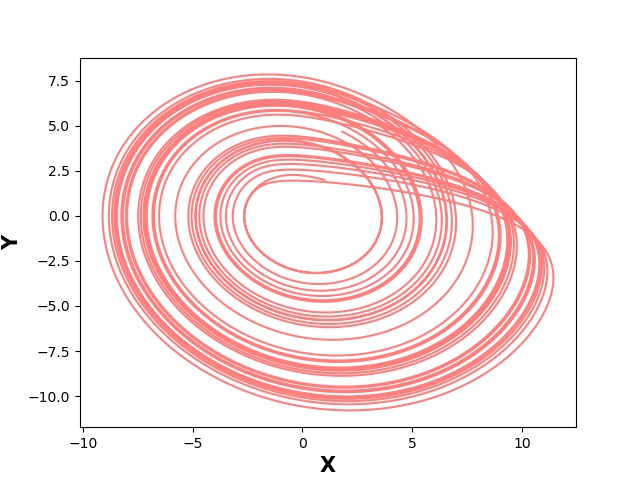
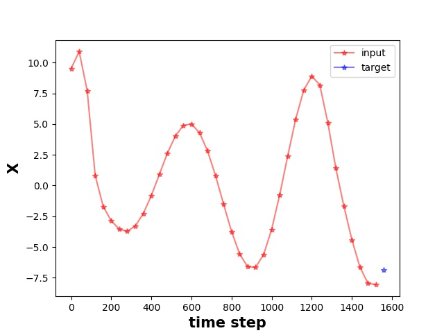

# Rössler-NN-simulator
This repo contains systematic experiments of a set of neural network models to forecast the nonlinear dynamics of Rössler attractor.

# Introduction
### Rössler system 
Rössler system is a system of three non-linear ordinary differential equations originally studied by Otto Rössler. More details see (https://en.wikipedia.org/wiki/R%C3%B6ssler_attractor). The system of ODEs is described by the equations below:

Given an initial condition, Runge-Kutta method was applied to find the numerical solution of the time series (see RosslerSolver.py for details). Then various nueral networks were explored to model the non-linear dynamics of Rössler attractors.    

# Visualization
For a special case where the parameters a=0.2, b=0.2, c=5.7 and the inital condition x=1, y=2, z=3, the trajectory of x(t), y(t), z(t) are shown below.
3D trajectory         |  xy projection         |  yz projection         |  xz projection
:--------------------:| :--------------------: | :--------------------: | :-------------------------:
     |       |       |   

Time series of x(t), y(t), z(t) are shown below as well. Even though the system is completely determinstic, small difference in the initial conditions can cause completely different trajectories in the far future. This phenomenon known as butterfly effect reflects the chaotic nature of the Rössler system. 

time series X         |  time series Y         |  time series Z         |  butterfly effect
:--------------------:| :--------------------: | :--------------------: | :-------------------------:
 |   |   |   

# Pre-Modelling Preparation
### Data splitting
The whole time series was split into training segment, validation segment and testing segment as below:

### Window Setting
A random window will be sampled out to train the model. One seeting you can change is the "stride" in config.json (sampling 1 point from stride number of orignal points). Another setting you can change is the window size ("w_size" in config.json). The first w_size-1 time points will be used as input to the model and the last one as prediction target. 

  

See some examples below:
w_size=40; stride=2                       |  w_size=40; stride=20                      |  w_size=40; stride=40         
:----------------------------------------:| :----------------------------------------: | :---------------------------------------: 
  |   |       

# Modelling
Three types of neural networks will be trained to simulate the non-linear dynamics of the Rössler attractor with fixed parameters (a=0.2, b=0.2, c=5.7). The type1 is Multilayer perceptron (MLP), the type2 is recurrent neural network (RNN) and the type3 is Transformer network using attention mechanism.
